# GlobtimPostProcessing Package Memory

## Project Information

**Repository**: `git@git.mpi-cbg.de:globaloptim/globtimpostprocessing.git`
**GitLab URL**: https://git.mpi-cbg.de/globaloptim/globtimpostprocessing
**Local Path**: `/Users/ghscholt/GlobalOptim/globtimpostprocessing`
**Package Name**: `GlobtimPostProcessing`

## Package Purpose

**GlobtimPostProcessing is the LOCAL REFINEMENT engine** for critical points computed by globtimcore. It takes raw critical point *candidates* from polynomial approximation and refines them to high numerical accuracy using local optimization (BFGS/Nelder-Mead).

### Primary Function: Critical Point Refinement

globtimcore finds critical point **candidates** via polynomial approximation. These candidates may have limited numerical accuracy (~1e-3 to 1e-6). GlobtimPostProcessing **refines** these candidates into verified critical points by:

1. **Loading** raw critical points from globtimcore CSV output
2. **Local optimization** (Optim.jl) from each candidate point
3. **Gradient validation** - verifying ||∇f(x*)|| ≈ 0
4. **Reporting** which candidates are true critical points with high precision (~1e-12)

### Secondary Functions

- Quality diagnostics (L2 error, stagnation detection)
- Parameter recovery analysis (distance to ground truth)
- Campaign aggregation and reporting
- Statistical analysis WITHOUT creating plots

## Critical Design Principle: NO PLOTTING IN THIS PACKAGE

🚨 **NEVER add plotting code to this package** 🚨

**Analysis ≠ Visualization**
- This package computes statistics and generates text/table reports
- For plots and figures, delegate to `globtimplots` package
- Keep analysis separate from visualization

**Forbidden dependencies:**
- ❌ Makie (CairoMakie, GLMakie, WGLMakie)
- ❌ Plots
- ❌ PyPlot
- ❌ Any visualization library

**If you need to visualize analysis results, use `globtimplots` package.**

## What BELONGS in globtimpostprocessing

✅ **Result Loading:**
- Load experiment results from CSV/JSON/JLD2
- Parse experiment metadata and configuration
- Handle multi-experiment campaigns
- Validate data integrity

✅ **Statistical Analysis:**
- Compute convergence statistics
- Parameter recovery metrics
- Quality diagnostics (L2 error, stagnation detection)
- Distribution analysis
- Aggregation across experiments

✅ **Data Transformations:**
- Filter and subset results
- Label-driven processing
- Campaign aggregation
- Cross-experiment comparisons

✅ **Report Generation (Text/Tables):**
- Terminal-friendly tables (PrettyTables)
- Markdown/LaTeX tables
- Summary statistics reports
- Campaign comparison reports
- CSV export of analysis results

✅ **Specialized Analysis Modules:**
- `ObjectiveFunctionRegistry.jl` - Reconstruct objective functions from configs
- `ParameterRecovery.jl` - Parameter recovery analysis
- `QualityDiagnostics.jl` - Quality checks and validation
- `BatchProcessing.jl` - Batch analysis workflows

✅ **Allowed Dependencies:**
- DataFrames, CSV - Data manipulation
- Statistics, LinearAlgebra - Statistical computations
- JSON, JSON3 - Config/metadata parsing
- Distributions - Statistical distributions
- PrettyTables - Terminal table formatting
- Tidier - Data wrangling (dplyr-style)
- ProgressMeter - Progress reporting

## What DOES NOT belong in globtimpostprocessing

❌ **Plotting/Visualization:**
- Creating figures → Use `globtimplots`
- Interactive plots → Use `globtimplots`
- Heat maps, contour plots → Use `globtimplots`
- Any Makie/Plots code → Use `globtimplots`

❌ **Core Optimization Algorithms:**
- Polynomial approximation → Use `globtimcore`
- Critical point solving → Use `globtimcore`
- Optimization routines → Use `globtimcore`
- Grid construction → Use `globtimcore`

❌ **Experiment Execution:**
- Running experiments → Use `globtimcore`
- Objective function evaluation → Use `globtimcore`
- StandardExperiment execution → Use `globtimcore`

## Architecture: Critical Point Refinement Pipeline

```mermaid
flowchart LR
    subgraph globtimcore
        A["Polynomial Approximation<br/>~1e-3 to 1e-6 accuracy"]
    end

    subgraph globtimpostprocessing
        B["1. Load raw CPs"] --> C["2. Local optimize<br/>(BFGS/Nelder-Mead)"]
        C --> D["3. Validate ‖∇f‖≈0"]
        D --> E["4. Report & diagnose"]
    end

    subgraph Result
        F["Verified Critical Points<br/>~1e-12 accuracy"]
    end

    A -->|CSV| B
    E --> F
    F -->|"refined data"| G["globtimplots<br/>(Visualizes results)"]
```



## Dependency on globtimcore

**Limited, Controlled Dependency:**

This package depends on globtimcore ONLY for:
- `ObjectiveFunctionRegistry.jl` uses globtimcore to load DynamicalSystems.jl
- Reconstructing objective functions from experiment configs

**How it works:**
```julia
# ObjectiveFunctionRegistry.jl does NOT import globtimcore
# Instead, it searches for globtimcore installation:
function load_dynamical_systems_module(globtim_root::Union{String, Nothing}=nothing)
    # Priority: 1) function arg, 2) ENV["GLOBTIM_ROOT"], 3) search paths
    # Loads Examples/systems/DynamicalSystems.jl from globtimcore
end
```

**Key principle**: NO circular dependency. GlobtimPostProcessing can use globtimcore, but globtimcore never imports GlobtimPostProcessing.

## Recent Changes (October 2025)

### Circular Dependency Removal
- Removed `Globtim` from Project.toml dependencies
- Modified `ObjectiveFunctionRegistry.jl` to use path-based loading instead of `pkgdir(Globtim)`
- Implemented fallback search strategies (function param, ENV var, relative paths)

**Rationale**: Eliminated circular dependency that prevented package precompilation. PostProcessing should never be a dependency of the core package.

## Key Modules

### Core Functionality
- `GlobtimPostProcessing.jl` - Main module
- `ResultsLoader.jl` - Load experiment results
- `LabelDispatcher.jl` - Label-driven processing
- `StatisticsCompute.jl` - Statistical computations
- `ReportGenerator.jl` - Text report generation
- `TableFormatting.jl` - Terminal-friendly tables

### Campaign Analysis
- `CampaignAnalysis.jl` - Multi-experiment aggregation
- `BatchProcessing.jl` - Batch processing workflows

### Specialized Analysis
- `ObjectiveFunctionRegistry.jl` - Reconstruct objectives from configs
- `ParameterRecovery.jl` - Parameter recovery metrics (Issue #7)
- `QualityDiagnostics.jl` - Quality checks (Issue #7, Phase 3)

## Data Structures

```julia
struct ExperimentResult
    experiment_id::String
    metadata::Dict{String, Any}
    enabled_tracking::Vector{String}
    tracking_capabilities::Vector{String}
    critical_points::Union{DataFrame, Nothing}
    performance_metrics::Union{Dict, Nothing}
    tolerance_validation::Union{Dict, Nothing}
    source_path::String
end

struct CampaignResults
    campaign_id::String
    experiments::Vector{ExperimentResult}
    campaign_metadata::Dict{String, Any}
    collection_timestamp::DateTime
end
```

## Typical Workflow

```julia
using GlobtimPostProcessing

# 1. Load single experiment
results = load_experiment_results("path/to/experiment")

# 2. Compute statistics
stats = compute_statistics(results)

# 3. Generate text report
report = generate_report(results, stats)
save_report(report, "analysis_report.txt")

# 4. Multi-experiment campaign
campaign = load_campaign_results("path/to/campaign_dir")
campaign_stats = analyze_campaign(campaign)

# 5. Export analysis results
CSV.write("campaign_summary.csv", campaign_stats)

# 6. For visualization, use globtimplots:
# using GlobtimPlots
# plots = create_experiment_plots(results)
# save_plot(plots[:convergence], "convergence.pdf")
```

## Decision Framework

**Before adding ANY new feature, ask:**

1. **What is the feature's primary purpose?**
   - Loading/analyzing data → Add to globtimpostprocessing ✅
   - Creating plots → **STOP!** Use globtimplots
   - Core algorithm → **STOP!** Use globtimcore

2. **Does it require plotting libraries?**
   - Yes → **STOP!** Use globtimplots instead
   - No → Continue

3. **Does it produce numerical/statistical results?**
   - Yes → Belongs in globtimpostprocessing ✅
   - No → Check if it's visualization (use globtimplots)

4. **Can results be shown as text/tables?**
   - Yes → Perfect for globtimpostprocessing ✅
   - No, must be visual → Use globtimplots

## Examples

| Feature | Correct Package | Why |
|---------|----------------|-----|
| Load experiment CSV files | globtimpostprocessing | Data loading ✅ |
| Plot convergence curves | globtimplots | Visualization |
| Compute mean parameter error | globtimpostprocessing | Statistics ✅ |
| Interactive heatmap | globtimplots | Visualization |
| Campaign summary table | globtimpostprocessing | Text report ✅ |
| Detect stagnation | globtimpostprocessing | Quality check ✅ |
| Level set visualization | globtimplots | Visualization |
| Parameter recovery stats | globtimpostprocessing | Analysis ✅ |
| 3D scatter plot | globtimplots | Visualization |
| Export analysis to CSV | globtimpostprocessing | Data export ✅ |

## Testing

```bash
# Run tests
cd /Users/ghscholt/GlobalOptim/globtimpostprocessing
julia --project=. -e 'using Pkg; Pkg.test()'

# Check precompilation
julia --project=. -e 'using GlobtimPostProcessing'

# Verify no plotting dependencies
grep -i "makie\|plots\|pyplot" Project.toml  # Should return empty

# Test ObjectiveFunctionRegistry
julia --project=. -e '
using GlobtimPostProcessing
ds = load_dynamical_systems_module()
println(names(ds))
'
```

## Notes for Claude Code

**When asked to add analysis features:**
1. ✅ Add to this package if it computes statistics or generates text reports
2. ❌ Do NOT add Makie/plotting dependencies
3. ✅ Can use DataFrames, Statistics, PrettyTables
4. ✅ Can export results as CSV/JSON for plotting in globtimplots
5. ❌ Do NOT create circular dependency with globtimcore

**When analysis needs visualization:**
```julia
# CORRECT: Separate analysis from visualization
# In globtimpostprocessing:
stats = compute_convergence_stats(results)  # Returns DataFrame

# In globtimplots (or user script):
using GlobtimPlots
plot = plot_convergence_stats(stats)  # Takes DataFrame, creates plot
```

## Related Documentation

- See `/Users/ghscholt/GlobalOptim/.claude/CLAUDE.md` for overall package structure
- See `globtimcore/.claude/CLAUDE.md` for core algorithm guidelines
- See `globtimplots/.claude/CLAUDE.md` for visualization guidelines
