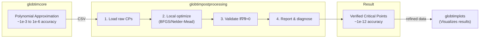

# GlobtimPostProcessing.jl

> **Core Purpose**: Take raw critical point **candidates** from globtimcore's polynomial approximation and **refine** them to high numerical accuracy using local optimization. The polynomial approximation finds *where* critical points might be (~1e-3 to 1e-6 accuracy); this package determines *if* they are true critical points and computes their precise coordinates (~1e-12 accuracy).

Local refinement engine for critical points computed by globtimcore. This package loads, refines, validates, and reports on experimental results.

> **Note**: For visualization/plotting, use the separate `globtimplots` package.

## Contents
- [Features](#features)
- [Quick Start](#quick-start)
- [LV4D Analysis](#lv4d-analysis)
- [Output Files](#output-files)
- [Architecture](#architecture)
- [API Reference](#api-reference)
- [Development](#development)

## Features

- **Critical Point Refinement**: Improve numerical accuracy of critical points using local optimization
- **Gradient Validation**: Verify critical points satisfy ||∇f(x*)|| ≈ 0
- **Quality Diagnostics**: L2 error assessment, stagnation detection, distribution analysis
- **Parameter Recovery**: Measure distance to ground truth parameters
- **Campaign Analysis**: Aggregate and compare results across multiple experiments
- **Label-Driven Processing**: Automatically discovers available data from experiment metadata

## Quick Start

### Refine Critical Points

The primary workflow: load raw critical points from `globtimcore` and refine them.

```julia
using GlobtimPostProcessing

# Define your objective function
function my_objective(p::Vector{Float64})
    # Your cost function here
    return cost
end

# Refine critical points from experiment output
refined = refine_experiment_results(
    "path/to/experiment_dir",
    my_objective
)

# Access results
println("Converged: $(refined.n_converged)/$(refined.n_raw)")
println("Best value: $(refined.best_refined_value)")

# Best parameter estimate
best_params = refined.refined_points[refined.best_refined_idx]
```

### Use ODE-Specific Configuration

For stiff ODE problems, use the preset configuration:

```julia
# Longer timeouts, robust mode for ODE objectives
refined = refine_experiment_results(
    experiment_dir,
    ode_objective,
    ode_refinement_config()
)
```

### Validate Gradient Norms

Verify that found critical points actually have zero gradient:

```julia
# Automatic: gradient validation runs automatically in refine_experiment_results()
# Results are in the printed summary and saved to CSV/JSON

# Manual: validate points directly
result = validate_critical_points(points, objective_func; tolerance=1e-6)
println("Valid critical points: $(result.n_valid)/$(length(points))")
println("Mean gradient norm: $(result.mean_norm)")
```

### Quality Diagnostics

Assess experiment quality:

```julia
# L2 approximation quality (dimension-aware grading)
l2_result = check_l2_quality(experiment_dir)
println("L2 Grade: $(l2_result.grade)")  # :excellent, :good, :acceptable, :poor

# Detect convergence stagnation
stagnation = detect_stagnation(experiment_dir)
if stagnation.detected
    println("Stagnation at degree $(stagnation.stagnation_degree)")
end

# Objective distribution analysis
dist_result = check_objective_distribution_quality(experiment_dir)
println("Outliers: $(dist_result.n_outliers)")
```

### Parameter Recovery Analysis

If ground truth parameters are available:

```julia
if has_ground_truth(experiment_dir)
    stats = compute_parameter_recovery_stats(experiment_dir)
    println("Best recovery error: $(stats.min_distance)")

    # Pretty table output
    generate_parameter_recovery_table(experiment_dir)
end
```

### Load and Analyze Experiments

```julia
# Load single experiment
result = load_experiment_results("path/to/experiment_dir")
stats = compute_statistics(result)

# Load campaign (multiple experiments)
campaign = load_campaign_results("path/to/campaign_dir")
campaign_stats = analyze_campaign(campaign)
```

## LV4D Analysis

Interactive analysis for Lotka-Volterra 4D parameter estimation experiments.

### TUI Interface

```julia
using GlobtimPostProcessing.LV4DAnalysis

# Launch interactive TUI with arrow-key menus
lv4d()
```

### Programmatic Analysis

```julia
using GlobtimPostProcessing.LV4DAnalysis

# Load and analyze experiments
filter = ExperimentFilter(gn=fixed(8), degree=sweep(4, 12))
analyze_sweep(nothing, filter)

# Coverage analysis
report = analyze_coverage(nothing;
    expected_domains=[0.01, 0.05, 0.1],
    expected_seeds=1:5)
print_coverage_report(report)
```

## Output Files

When running `refine_experiment_results()`, these files are created:

| File | Description |
|------|-------------|
| `critical_points_refined_deg_X.csv` | Refined critical point coordinates |
| `refinement_comparison_deg_X.csv` | Raw vs refined comparison with diagnostics |
| `refinement_summary_deg_X.json` | Statistics, timing, gradient validation |

### CSV Columns (refinement_comparison)

- `raw_dim1..N`, `refined_dim1..N` — Point coordinates
- `raw_value`, `refined_value` — Objective values
- `converged`, `iterations` — Convergence status
- `f_calls`, `g_calls`, `time_elapsed` — Performance metrics
- `convergence_reason` — Why optimization stopped
- `gradient_norm`, `gradient_valid` — Gradient validation

### JSON Summary

```json
{
  "n_converged": 15,
  "convergence_rate": 0.83,
  "best_refined_value": 1.23e-12,
  "convergence_breakdown": {"g_tol": 10, "f_tol": 3, "timeout": 2},
  "gradient_validation": {
    "n_valid": 14,
    "mean_norm": 2.34e-8,
    "validation_rate": 0.93
  }
}
```

## Architecture



This package is the **refinement layer** — it refines critical point candidates but does not create visualizations. For plots, use `globtimplots`:

```julia
using GlobtimPostProcessing
using GlobtimPlots

# Analyze
result = load_experiment_results(exp_dir)
stats = compute_statistics(result)

# Visualize (in globtimplots)
fig = create_experiment_plots(result, stats)
save_plot(fig, "analysis.png")
```

## Quick Reference Card

**Most common workflow:**
```julia
using GlobtimPostProcessing

# 1. Refine critical points from globtimcore output
refined = refine_experiment_results("experiment_dir", my_objective)

# 2. Check results
refined.n_converged       # Number of converged points
refined.best_refined_value # Best objective value found
refined.refined_points    # Vector of refined coordinates
```

**Key functions:**
| Task | Function |
|------|----------|
| Refine all points | `refine_experiment_results(dir, objective)` |
| Validate gradients | `validate_critical_points(points, objective)` |
| Check L2 quality | `check_l2_quality(dir)` |
| Load results | `load_experiment_results(dir)` |

---

## API Reference

### Refinement

| Function | Description |
|----------|-------------|
| `refine_experiment_results(dir, objective)` | Main refinement workflow |
| `refine_critical_points(raw_result, objective)` | Refine from result object |
| `refine_critical_point(objective, point)` | Single point refinement |
| `RefinementConfig()` | Configuration struct |
| `ode_refinement_config()` | ODE-optimized preset |

### Gradient Validation

| Function | Description |
|----------|-------------|
| `validate_critical_points(points, objective)` | Validate batch of points |
| `compute_gradient_norms(points, objective)` | Compute ||∇f|| for points |
| `add_gradient_validation!(df, objective)` | Add validation to DataFrame |

### Quality Diagnostics

| Function | Description |
|----------|-------------|
| `check_l2_quality(dir)` | L2 approximation assessment |
| `detect_stagnation(dir)` | Convergence stagnation detection |
| `check_objective_distribution_quality(dir)` | Outlier detection |

### Parameter Recovery

| Function | Description |
|----------|-------------|
| `has_ground_truth(dir)` | Check if p_true available |
| `compute_parameter_recovery_stats(dir)` | Recovery statistics |
| `generate_parameter_recovery_table(dir)` | Pretty-printed table |

### Data Loading

| Function | Description |
|----------|-------------|
| `load_experiment_results(dir)` | Load single experiment |
| `load_campaign_results(dir)` | Load experiment campaign |
| `load_raw_critical_points(dir)` | Load raw CSV points |

## Development

### Running Tests

```julia
using Pkg
Pkg.activate(".")
Pkg.test()
```

### Project Structure

```
src/
├── GlobtimPostProcessing.jl       # Main module
├── display_helpers.jl             # Shared formatting: fmt_sci, fmt_time, fmt_pct, print_section
├── ResultsLoader.jl               # Data loading
├── LabelDispatcher.jl             # Label-driven processing dispatch
├── StatisticsCompute.jl           # Statistics computation
├── ReportGenerator.jl             # Report generation
├── TableFormatting.jl             # Terminal-friendly table formatting
├── CampaignAnalysis.jl            # Campaign-level analysis
├── BatchProcessing.jl             # Batch processing functionality
├── ParameterRecovery.jl           # Parameter recovery analysis
├── QualityDiagnostics.jl         # Quality assessment
├── CriticalPointClassification.jl # Hessian-based critical point classification
├── LandscapeFidelity.jl          # Polynomial vs objective basin assessment
├── experiment_display.jl          # Pipeline orchestration + display functions
├── ValleyWalking.jl               # Positive-dimensional minima tracing
├── SubdivisionTreeAnalysis.jl     # Adaptive subdivision postprocessing
├── EnhancedAnalysis.jl            # Statistical tables and validation
├── refinement/
│   ├── config.jl                  # RefinementConfig struct + bounds helpers
│   ├── core_refinement.jl         # Optim.jl integration
│   ├── gradient_validation.jl     # Gradient norm validation
│   ├── newton_refinement.jl       # Newton-based critical point refinement
│   ├── capture_analysis.jl        # Capture analysis for known critical points
│   ├── io.jl                      # CSV/JSON I/O
│   └── api.jl                     # High-level refinement API
├── unified/
│   ├── UnifiedPipeline.jl         # Unified pipeline module
│   ├── experiment_types.jl        # Experiment type definitions
│   ├── base_data.jl               # Base experiment data structures
│   ├── loaders.jl                 # Type-aware experiment loaders
│   ├── tui_main.jl                # Main TUI entry point
│   └── tui_menus.jl               # TUI menu definitions
└── lv4d/
    ├── LV4DAnalysis.jl            # LV4D analysis module
    ├── common.jl                  # Shared utilities
    ├── data_loading.jl            # LV4D data loading
    ├── query.jl                   # Experiment querying
    ├── sweep.jl                   # Parameter sweep analysis
    ├── convergence.jl             # Convergence analysis
    ├── coverage.jl                # Coverage analysis
    ├── gradients.jl               # Gradient analysis
    ├── minima.jl                  # Minima analysis
    ├── quality.jl                 # Quality assessment
    ├── comparison.jl              # Experiment comparison
    ├── interactive.jl             # Interactive analysis
    └── tui.jl                     # LV4D TUI interface
```

## License

GPL-3.0

## Authors

- Georgy Scholten
