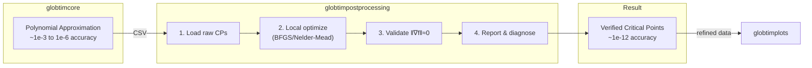

# GlobtimPostProcessing.jl

Local refinement engine for critical points computed by globtimcore.

## Overview

GlobtimPostProcessing.jl **refines critical point candidates** found by [Globtim.jl](https://git.mpi-cbg.de/globaloptim/globtimcore) into verified, high-accuracy critical points.

!!! info "Why Refinement is Necessary"
    Polynomial approximation methods find critical point **candidates**, but these have limited numerical accuracy (~1e-3 to 1e-6). Local optimization refines these candidates to machine precision (~1e-12) and validates them by checking ||∇f(x*)|| ≈ 0.



## Key Features

- **Critical Point Refinement**: Improve numerical accuracy of critical points using local optimization (BFGS)
- **Gradient Validation**: Verify critical points satisfy ||∇f(x*)|| ≈ 0
- **Quality Diagnostics**: L2 error assessment, stagnation detection, distribution analysis
- **Parameter Recovery**: Measure distance to ground truth parameters
- **Campaign Analysis**: Aggregate and compare results across multiple experiments
- **Label-Driven Processing**: Automatically discovers available data from experiment metadata

## Installation

```julia
using Pkg
Pkg.add("GlobtimPostProcessing")
```

Or for development:

```julia
Pkg.develop(path="/path/to/globtimpostprocessing")
```

## Quick Example

```julia
using GlobtimPostProcessing

# Define your objective function
function my_objective(p::Vector{Float64})
    # Your cost function here
    return cost
end

# Refine critical points from experiment output
refined = refine_experiment_results(
    "path/to/experiment_dir",
    my_objective
)

# Access results
println("Converged: \$(refined.n_converged)/\$(refined.n_raw)")
println("Best value: \$(refined.best_refined_value)")

# Best parameter estimate
best_params = refined.refined_points[refined.best_refined_idx]
```

## Package Architecture

This package is the **refinement layer** without visualization dependencies:

| Package | Purpose |
|---------|---------|
| **globtimcore** | Polynomial approximation, critical point candidates |
| **globtimpostprocessing** | Local refinement, validation, quality diagnostics |
| **globtimplots** | Visualization of refined results |

For plotting and visualization, use the separate [GlobtimPlots](https://git.mpi-cbg.de/globaloptim/globtimplots) package:

```julia
using GlobtimPostProcessing
using GlobtimPlots

# Analyze
result = load_experiment_results(exp_dir)
stats = compute_statistics(result)

# Visualize (in globtimplots)
fig = create_experiment_plots(result, stats)
save_plot(fig, "analysis.png")
```

## Documentation

- [Getting Started](getting_started.md) - Installation and basic workflow
- [Critical Point Refinement](refinement.md) - Local optimization of critical points
- [Quality Diagnostics](quality_diagnostics.md) - L2 quality, stagnation detection
- [Parameter Recovery](parameter_recovery.md) - Ground truth comparison
- [Landscape Fidelity](landscape_fidelity.md) - Polynomial vs objective assessment
- [Campaign Analysis](campaign_analysis.md) - Multi-experiment aggregation
- [Examples](workflow_examples.md) - Complete workflow examples
- [API Reference](api_reference.md) - Full function reference

## Related Packages

- [Globtim.jl](https://git.mpi-cbg.de/globaloptim/globtimcore) - Core optimization engine
- [GlobtimPlots](https://git.mpi-cbg.de/globaloptim/globtimplots) - Visualization layer

## License

GPL-3.0
