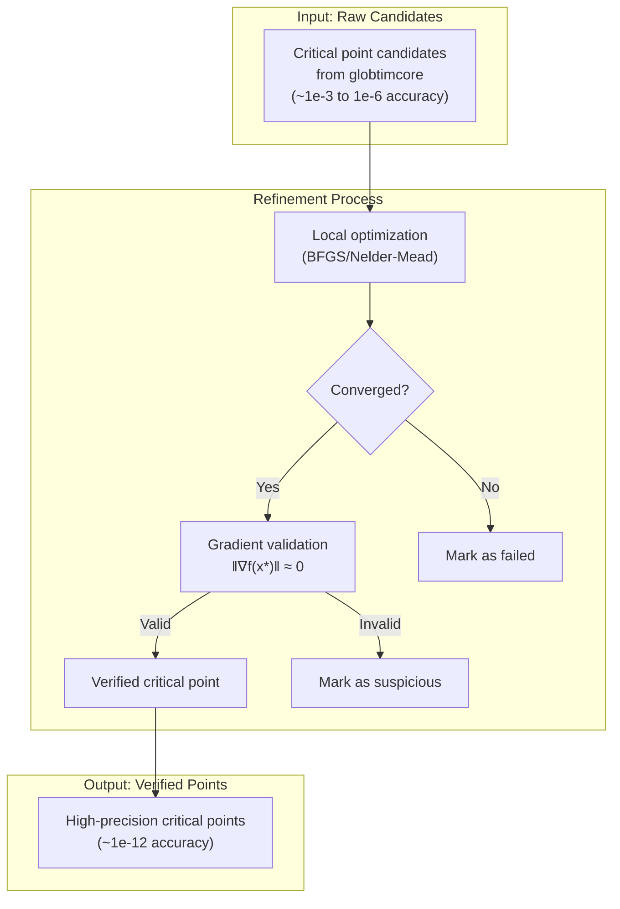

# Critical Point Refinement

This guide covers the critical point refinement system in GlobtimPostProcessing.jl.

## Why Refinement is Necessary

!!! warning "Polynomial approximation has limited accuracy"
    Critical points found by polynomial approximation are **candidates**, not verified solutions. Their numerical accuracy is typically 1e-3 to 1e-6, which may be insufficient for:
    - Parameter estimation problems requiring high precision
    - Verifying that candidates are true critical points (not numerical artifacts)
    - Downstream analysis requiring accurate function values

!!! tip "Local optimization provides verification"
    By running local optimization from each candidate:
    1. True critical points converge to high precision (~1e-12)
    2. False positives fail to converge or move to different locations
    3. Gradient validation (||∇f|| ≈ 0) confirms criticality



## Overview

Critical points found by polynomial approximation methods may have limited numerical accuracy. The refinement system uses local optimization (Optim.jl) to improve accuracy by starting from the polynomial critical points and converging to nearby objective function minima.

**Key workflow:**
1. Load raw critical points from globtimcore output
2. Run local optimization from each point
3. Validate convergence using gradient norms
4. Save refined results with diagnostics

## Quick Start

```julia
using GlobtimPostProcessing

# Define your objective function
function my_objective(p::Vector{Float64})
    return compute_cost(p)  # Your cost function
end

# Refine critical points
refined = refine_experiment_results(
    "path/to/experiment_dir",
    my_objective
)

# Check results
println("Converged: \$(refined.n_converged)/\$(refined.n_raw)")
println("Best value: \$(refined.best_refined_value)")
```

**Expected output:**
```
Refining 25 critical points from degree 10...
  [========================================] 100%  25/25
────────────────────────────────────────────────────────
  Refinement Summary (degree 10)
────────────────────────────────────────────────────────
  Raw points:        25
  Converged:         20 (80.0%)
  Best value:        2.34e-12
────────────────────────────────────────────────────────
  Convergence breakdown:
    g_tol:           15
    f_tol:           3
    x_tol:           2
    timeout:         3
    iterations:      2
────────────────────────────────────────────────────────
  Gradient validation:
    Valid:           18/20 (90.0%)
    Mean ||∇f||:     3.21e-9
────────────────────────────────────────────────────────
```

## RefinementConfig Options

The `RefinementConfig` struct controls refinement behavior:

```julia
config = RefinementConfig(;
    method = NelderMead(),        # Optimizer (default: gradient-free)
    max_time_per_point = 30.0,    # Timeout per point (seconds)
    f_abstol = 1e-8,              # Function value tolerance
    x_abstol = 1e-8,              # Parameter tolerance
    max_iterations = 1000,        # Max iterations per point
    show_progress = true,         # Show progress bar
    gradient_tolerance = 1e-6,    # Gradient norm tolerance for validation
    gradient_method = :forwarddiff  # :forwarddiff or :finitediff
)

refined = refine_experiment_results(experiment_dir, objective, config)
```

### Available Optimizers

```julia
using Optim

# Gradient-free (default, robust)
config = RefinementConfig(method = NelderMead())

# Gradient-based (faster if objective is smooth)
config = RefinementConfig(method = BFGS())

# L-BFGS for large-scale problems
config = RefinementConfig(method = LBFGS())
```

## ODE-Specific Configuration

For stiff ODE parameter estimation problems, use the preset:

```julia
config = ode_refinement_config()

refined = refine_experiment_results(experiment_dir, ode_objective, config)
```

This configuration provides:
- **Extended timeout** (60s per point) - ODE evaluations can be slow
- **Finite differences** for gradients - more robust than ForwardDiff for stiff ODEs
- **Increased iterations** (5000) - allow more exploration
- **Relaxed tolerances** - appropriate for noisy ODE objectives

## Gradient Validation

After refinement, critical points are validated by checking ||∇f(x*)|| ≈ 0:

```julia
# Automatic: validation runs automatically in refine_experiment_results()
# Results appear in summary and output files

# Manual validation
result = validate_critical_points(refined_points, objective_func; tolerance=1e-6)

println("Valid critical points: \$(result.n_valid)/\$(length(refined_points))")
println("Mean gradient norm: \$(result.mean_norm)")
```

### Gradient Methods

Two methods are available:

```julia
# ForwardDiff (default) - exact gradients, requires differentiable objective
config = RefinementConfig(gradient_method = :forwarddiff)

# FiniteDiff - numerical gradients, works with any objective
config = RefinementConfig(gradient_method = :finitediff)
```

Use `:finitediff` for:
- ODE-based objectives
- Objectives with discontinuities
- Black-box objective functions

## Output Files

`refine_experiment_results()` creates three files per degree:

### critical_points_refined_deg_X.csv

Refined critical point coordinates:

```csv
x1,x2,x3,x4
0.123,0.456,0.789,0.012
...
```

### refinement_comparison_deg_X.csv

Raw vs refined comparison with full diagnostics:

| Column | Description |
|--------|-------------|
| `raw_dim1..N` | Original point coordinates |
| `refined_dim1..N` | Refined point coordinates |
| `raw_value` | f(x_raw) |
| `refined_value` | f(x_refined) |
| `converged` | Convergence status |
| `iterations` | Number of iterations |
| `f_calls` | Function evaluations |
| `g_calls` | Gradient evaluations |
| `time_elapsed` | Time per point (seconds) |
| `convergence_reason` | Why optimization stopped |
| `gradient_norm` | ||∇f(x_refined)|| |
| `gradient_valid` | Passes gradient tolerance |

### refinement_summary_deg_X.json

Statistics and metadata:

```json
{
  "n_raw": 25,
  "n_converged": 20,
  "n_failed": 3,
  "n_timeout": 2,
  "convergence_rate": 0.8,
  "mean_improvement": 1.5e-8,
  "best_refined_value": 2.3e-12,
  "convergence_breakdown": {
    "g_tol": 15,
    "f_tol": 3,
    "x_tol": 2,
    "iterations": 3,
    "timeout": 2
  },
  "gradient_validation": {
    "n_valid": 18,
    "mean_norm": 3.2e-9,
    "validation_rate": 0.9
  },
  "total_time": 45.2
}
```

## Convergence Reasons

The `convergence_reason` field indicates why optimization stopped:

| Reason | Description |
|--------|-------------|
| `:g_tol` | Gradient norm below tolerance (ideal for critical points) |
| `:f_tol` | Function value converged |
| `:x_tol` | Parameters stopped changing |
| `:iterations` | Hit max iterations without converging |
| `:timeout` | Exceeded time limit |
| `:error` | Optimization failed |

## Interpreting Results

!!! success "Good Results"
    - **Convergence rate > 80%**: Most candidates are true critical points
    - **Most convergence by `:g_tol`**: Gradient criterion is ideal for critical points
    - **Gradient validation rate > 90%**: Refined points are verified critical points
    - **Mean gradient norm < 1e-6**: High precision achieved

!!! danger "Warning Signs"
    - **Convergence rate < 50%**: Many candidates may be false positives
    - **Many timeouts**: Increase `max_time_per_point`
    - **Many iteration limits**: Increase `max_iterations`
    - **Low gradient validation**: Points may not be true critical points

### Troubleshooting

**0% convergence rate**
```julia
# Check convergence breakdown in JSON
# If all "iterations" → increase max_iterations
# If all "timeout" → increase max_time_per_point
# If objective fails → check objective function implementation
```

**Slow refinement**
```julia
# Use gradient-based optimizer if objective is smooth
config = RefinementConfig(method = BFGS())

# Or reduce timeout for quick screening
config = RefinementConfig(max_time_per_point = 5.0)
```

**Gradient validation fails**
```julia
# Points may not be true critical points
# Check L2 approximation quality
l2_result = check_l2_quality(experiment_dir)

# Try more lenient tolerance
config = RefinementConfig(gradient_tolerance = 1e-4)
```

## Advanced Usage

### Single Point Refinement

```julia
point = [0.1, 0.2, 0.3, 0.4]
result = refine_critical_point(objective, point)

println("Converged: \$(result.converged)")
println("Refined: \$(result.refined)")
println("Improvement: \$(result.improvement)")
```

### Custom Optimizer Configuration

```julia
using Optim

# Fine-tuned BFGS
config = RefinementConfig(
    method = BFGS(linesearch = BackTracking()),
    f_abstol = 1e-12,
    x_abstol = 1e-12,
    max_iterations = 2000
)
```

### Accessing Full Diagnostics

```julia
result = refine_experiment_results(dir, objective)

# Per-point diagnostics
for (i, status) in enumerate(result.convergence_status)
    if !status
        println("Point $i failed to converge")
    end
end

# Summary statistics
println("Mean improvement: \$(result.mean_improvement)")
println("Max improvement: \$(result.max_improvement)")
```

## See Also

- [Getting Started](getting_started.md) - Basic workflow
- [Quality Diagnostics](quality_diagnostics.md) - L2 quality assessment
- [API Reference](api_reference.md) - Full function documentation
- [Globtim.jl Critical Point Analysis](https://gescholt.github.io/Globtim.jl/stable/critical_point_analysis) - Core algorithm
