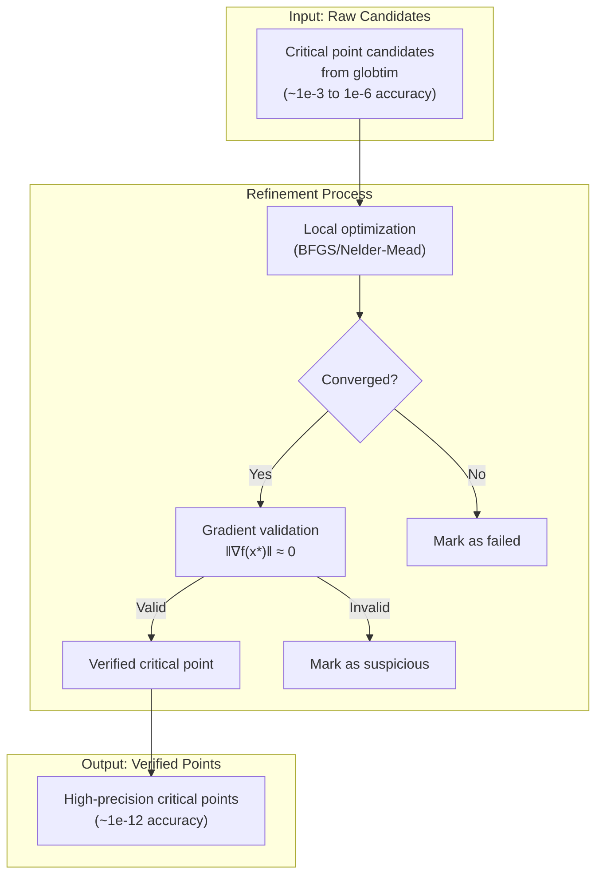

# Critical Point Refinement

This guide covers the critical point refinement system in GlobtimPostProcessing.jl.

## Why Refinement is Necessary

!!! warning "Polynomial approximation has limited accuracy"
    Critical points found by polynomial approximation are **candidates**, not verified solutions. Their numerical accuracy is typically 1e-3 to 1e-6, which may be insufficient for:
    - Parameter estimation problems requiring high precision
    - Verifying that candidates are true critical points (not numerical artifacts)
    - Downstream analysis requiring accurate function values

!!! tip "Local optimization provides verification"
    By running local optimization from each candidate:
    1. True critical points converge to high precision (~1e-12)
    2. False positives fail to converge or move to different locations
    3. Gradient validation (||∇f|| ≈ 0) confirms criticality


```mermaid
flowchart TB
    subgraph "Input: Raw Candidates"
        A["Critical point candidates<br/>from globtim<br/>(~1e-3 to 1e-6 accuracy)"]
    end

    subgraph "Refinement Process"
        B["Local optimization<br/>(BFGS/Nelder-Mead)"] --> C{"Converged?"}
        C -->|Yes| D["Gradient validation<br/>‖∇f(x*)‖ ≈ 0"]
        C -->|No| E["Mark as failed"]
        D -->|Valid| F["Verified critical point"]
        D -->|Invalid| G["Mark as suspicious"]
    end

    subgraph "Output: Verified Points"
        H["High-precision critical points<br/>(~1e-12 accuracy)"]
    end

    A --> B
    F --> H
```

## Overview

Critical points found by polynomial approximation methods may have limited numerical accuracy. The refinement system provides two complementary approaches:

1. **Trust-region Newton** (`refine_to_critical_point`): Solves ∇f(x) = 0 directly using second-order information (Hessian eigendecomposition). Classifies critical points as minimum/maximum/saddle via Hessian eigenvalues. Recommended for interactive exploration and high-precision refinement.

2. **Optim.jl-based refinement** (`refine_experiment_results`): Uses first-order (BFGS, L-BFGS) or gradient-free (NelderMead) optimizers from Optim.jl. Designed for batch post-processing of experiment results with CSV/JSON output.

**Key workflow:**
1. Load raw critical points from globtim output
2. Run local optimization from each point
3. Validate convergence using gradient norms
4. Save refined results with diagnostics

## Quick Start

```julia
using GlobtimPostProcessing

# Define your objective function
function my_objective(p::Vector{Float64})
    return compute_cost(p)  # Your cost function
end

# Refine critical points
refined = refine_experiment_results(
    "path/to/experiment_dir",
    my_objective
)

# Check results
println("Converged: \$(refined.n_converged)/\$(refined.n_raw)")
println("Best value: \$(refined.best_refined_value)")
```

**Expected output:**
```
Refining 25 critical points from degree 10...
  [========================================] 100%  25/25
────────────────────────────────────────────────────────
  Refinement Summary (degree 10)
────────────────────────────────────────────────────────
  Raw points:        25
  Converged:         20 (80.0%)
  Best value:        2.34e-12
────────────────────────────────────────────────────────
  Convergence breakdown:
    g_tol:           15
    f_tol:           3
    x_tol:           2
    timeout:         3
    iterations:      2
────────────────────────────────────────────────────────
  Gradient validation:
    Valid:           18/20 (90.0%)
    Mean ||∇f||:     3.21e-9
────────────────────────────────────────────────────────
```

## RefinementConfig Options

The `RefinementConfig` struct controls refinement behavior:

```julia
config = RefinementConfig(;
    method = NelderMead(),        # Optimizer (default: gradient-free)
    max_time_per_point = 30.0,    # Timeout per point (seconds)
    f_abstol = 1e-8,              # Function value tolerance
    x_abstol = 1e-8,              # Parameter tolerance
    max_iterations = 1000,        # Max iterations per point
    show_progress = true,         # Show progress bar
    gradient_tolerance = 1e-6,    # Gradient norm tolerance for validation
    gradient_method = :forwarddiff  # :forwarddiff or :finitediff
)

refined = refine_experiment_results(experiment_dir, objective, config)
```

### Available Optimizers

```julia
using Optim

# Gradient-free (default, robust)
config = RefinementConfig(method = NelderMead())

# Gradient-based (faster if objective is smooth)
config = RefinementConfig(method = BFGS())

# L-BFGS for large-scale problems
config = RefinementConfig(method = LBFGS())
```

## ODE-Specific Configuration

For stiff ODE parameter estimation problems, use the preset:

```julia
config = ode_refinement_config()

refined = refine_experiment_results(experiment_dir, ode_objective, config)
```

This configuration provides:
- **Extended timeout** (60s per point) - ODE evaluations can be slow
- **Finite differences** for gradients - more robust than ForwardDiff for stiff ODEs
- **Increased iterations** (5000) - allow more exploration
- **Relaxed tolerances** - appropriate for noisy ODE objectives

## Gradient Validation

After refinement, critical points are validated by checking ||∇f(x*)|| ≈ 0:

```julia
# Automatic: validation runs automatically in refine_experiment_results()
# Results appear in summary and output files

# Manual validation
result = validate_critical_points(refined_points, objective_func; tolerance=1e-6)

println("Valid critical points: \$(result.n_valid)/\$(length(refined_points))")
println("Mean gradient norm: \$(result.mean_norm)")
```

### Gradient Methods

Two methods are available:

```julia
# ForwardDiff (default) - exact gradients, requires differentiable objective
config = RefinementConfig(gradient_method = :forwarddiff)

# FiniteDiff - numerical gradients, works with any objective
config = RefinementConfig(gradient_method = :finitediff)
```

Use `:finitediff` for:
- ODE-based objectives
- Objectives with discontinuities
- Black-box objective functions

## Output Files

`refine_experiment_results()` creates three files per degree:

### critical_points_refined_deg_X.csv

Refined critical point coordinates:

```csv
x1,x2,x3,x4
0.123,0.456,0.789,0.012
...
```

### refinement_comparison_deg_X.csv

Raw vs refined comparison with full diagnostics:

| Column | Description |
|--------|-------------|
| `raw_dim1..N` | Original point coordinates |
| `refined_dim1..N` | Refined point coordinates |
| `raw_value` | f(x_raw) |
| `refined_value` | f(x_refined) |
| `converged` | Convergence status |
| `iterations` | Number of iterations |
| `f_calls` | Function evaluations |
| `g_calls` | Gradient evaluations |
| `time_elapsed` | Time per point (seconds) |
| `convergence_reason` | Why optimization stopped |
| `gradient_norm` | ||∇f(x_refined)|| |
| `gradient_valid` | Passes gradient tolerance |

### refinement_summary_deg_X.json

Statistics and metadata:

```json
{
  "n_raw": 25,
  "n_converged": 20,
  "n_failed": 3,
  "n_timeout": 2,
  "convergence_rate": 0.8,
  "mean_improvement": 1.5e-8,
  "best_refined_value": 2.3e-12,
  "convergence_breakdown": {
    "g_tol": 15,
    "f_tol": 3,
    "x_tol": 2,
    "iterations": 3,
    "timeout": 2
  },
  "gradient_validation": {
    "n_valid": 18,
    "mean_norm": 3.2e-9,
    "validation_rate": 0.9
  },
  "total_time": 45.2
}
```

## Convergence Reasons

The `convergence_reason` field indicates why optimization stopped:

| Reason | Description |
|--------|-------------|
| `:g_tol` | Gradient norm below tolerance (ideal for critical points) |
| `:f_tol` | Function value converged |
| `:x_tol` | Parameters stopped changing |
| `:iterations` | Hit max iterations without converging |
| `:timeout` | Exceeded time limit |
| `:error` | Optimization failed |

## Interpreting Results

!!! success "Good Results"
    - **Convergence rate > 80%**: Most candidates are true critical points
    - **Most convergence by `:g_tol`**: Gradient criterion is ideal for critical points
    - **Gradient validation rate > 90%**: Refined points are verified critical points
    - **Mean gradient norm < 1e-6**: High precision achieved

!!! danger "Warning Signs"
    - **Convergence rate < 50%**: Many candidates may be false positives
    - **Many timeouts**: Increase `max_time_per_point`
    - **Many iteration limits**: Increase `max_iterations`
    - **Low gradient validation**: Points may not be true critical points

### Troubleshooting

**0% convergence rate**
```julia
# Check convergence breakdown in JSON
# If all "iterations" → increase max_iterations
# If all "timeout" → increase max_time_per_point
# If objective fails → check objective function implementation
```

**Slow refinement**
```julia
# Use gradient-based optimizer if objective is smooth
config = RefinementConfig(method = BFGS())

# Or reduce timeout for quick screening
config = RefinementConfig(max_time_per_point = 5.0)
```

**Gradient validation fails**
```julia
# Points may not be true critical points
# Check L2 approximation quality
l2_result = check_l2_quality(experiment_dir)

# Try more lenient tolerance
config = RefinementConfig(gradient_tolerance = 1e-4)
```

## Trust-Region Newton Refinement

The `refine_to_critical_point` function uses trust-region Newton's method with Hessian eigendecomposition. This is the recommended method for interactive exploration and when full critical point classification (minimum/maximum/saddle) is needed.

### Basic Usage

```julia
using GlobtimPostProcessing

result = refine_to_critical_point(objective, [1.0, 1.5];
    bounds = [(0.0, 10.0), (0.0, 10.0)],
    trace = true,
)

println("Point: $(result.point)")
println("Type: $(result.cp_type)")          # :minimum, :maximum, :saddle, :degenerate
println("‖∇f‖: $(result.gradient_norm)")
println("Eigenvalues: $(result.eigenvalues)")
println("Converged: $(result.converged)")
```

### Two Modes

```julia
# Critical point mode (default): solve ∇f = 0 — finds minima, maxima, AND saddles
result_cp = refine_to_critical_point(objective, start;
    mode = :critical_point)

# Minimize mode: modified Newton with |λ| eigenvalues — descent only, avoids saddles
result_min = refine_to_critical_point(objective, start;
    mode = :minimize)
```

In `:minimize` mode, each Hessian eigenvalue λ is replaced with |λ| in the Newton step, making the effective Hessian positive-definite. The quality ratio ρ measures objective decrease instead of gradient norm reduction.

### Key Parameters

| Parameter | Default | Description |
|-----------|---------|-------------|
| `tol` | 1e-8 | Convergence: ‖∇f‖ < tol |
| `accept_tol` | Inf | Relaxed acceptance: classify if ‖∇f‖ < accept_tol |
| `f_accept_tol` | nothing | Accept if f(x) < threshold (for ODE objectives with large gradients) |
| `max_iterations` | 100 | Maximum Newton iterations |
| `hessian_tol` | 1e-6 | Absolute eigenvalue threshold for min/max/saddle classification |
| `hessian_relative_tol` | 0.0 | Relative eigenvalue threshold (adapts to eigenvalue scale) |
| `trust_radius_fraction` | 0.1 | Initial trust radius as fraction of domain diameter |
| `patience` | 10 | Iterations without improvement before early exit |
| `min_improvement_ratio` | 0.99 | Bail if best ‖∇f‖ hasn't improved by this ratio |
| `gradient_method` | :finitediff | `:finitediff` or `:forwarddiff` |
| `mode` | :critical_point | `:critical_point` or `:minimize` |

### CriticalPointRefinementResult

The result struct contains:

| Field | Type | Description |
|-------|------|-------------|
| `point` | `Vector{Float64}` | Refined coordinates |
| `objective_value` | `Float64` | f(point) |
| `cp_type` | `Symbol` | `:minimum`, `:maximum`, `:saddle`, `:degenerate`, or `:unknown` |
| `eigenvalues` | `Vector{Float64}` | Hessian eigenvalues (empty if rejected) |
| `condition_number` | `Float64` | Hessian condition number |
| `gradient_norm` | `Float64` | Final ‖∇f(point)‖ |
| `converged` | `Bool` | Whether ‖∇f‖ < tol |
| `iterations` | `Int` | Newton iterations used |
| `trace` | `Vector{Vector{Float64}}` | Iteration path (if trace=true) |
| `rejected_steps` | `Int` | Trust-region step rejections |
| `gradient_method` | `Symbol` | Differentiation backend used |

### Batch Newton Refinement

```julia
results = refine_to_critical_points(objective, points;
    accept_tol = 1e-2,
    f_accept_tol = 1e-6,
    kwargs...
)
```

### Choosing Between Objectives: Display vs Refinement

For ODE parameter estimation with log-distance objectives (e.g., `log_L2_norm`), the log transform creates a singularity at the true parameter values where `log(0) → -∞`. This makes gradient-based refinement fail because:

- ‖∇f‖ remains large even at the true minimum (cusp at sqrt(0))
- cond(H) ~ 1e10 (numerically intractable Hessian)
- Newton CP mode finds p_true only 1/15 times vs 14/15 for BFGS on raw L2_norm

**Solution**: Use `Dynamic_objectives.create_refinement_objective(entry)` which auto-detects `log_` distance functions and substitutes the raw variant (e.g., `L2_norm` for `log_L2_norm`). Keep `create_objective(entry)` for visualization (log scale provides better dynamic range for contour plots).

```julia
using Dynamic_objectives

entry = load_catalogue("catalogue.jsonl")[1]
display_obj = create_objective(entry)                # log_L2_norm — good for plots
refine_obj  = create_refinement_objective(entry)     # auto-detected L2_norm — good for Newton

# Refinement uses the non-log objective
result = refine_to_critical_point(refine_obj, start_point; bounds=...)
```

## Advanced Usage

### Single Point Refinement (Optim.jl)

```julia
point = [0.1, 0.2, 0.3, 0.4]
result = refine_critical_point(objective, point)

println("Converged: \$(result.converged)")
println("Refined: \$(result.refined)")
println("Improvement: \$(result.improvement)")
```

### Custom Optimizer Configuration

```julia
using Optim

# Fine-tuned BFGS
config = RefinementConfig(
    method = BFGS(linesearch = BackTracking()),
    f_abstol = 1e-12,
    x_abstol = 1e-12,
    max_iterations = 2000
)
```

### Accessing Full Diagnostics

```julia
result = refine_experiment_results(dir, objective)

# Per-point diagnostics
for (i, status) in enumerate(result.convergence_status)
    if !status
        println("Point $i failed to converge")
    end
end

# Summary statistics
println("Mean improvement: \$(result.mean_improvement)")
println("Max improvement: \$(result.max_improvement)")
```

## See Also

- [Getting Started](getting_started.md) - Basic workflow
- [Quality Diagnostics](quality_diagnostics.md) - L2 quality assessment
- [API Reference](api_reference.md) - Full function documentation
- [Globtim.jl Critical Point Analysis](https://gescholt.github.io/Globtim.jl/stable/critical_point_analysis) - Core algorithm
